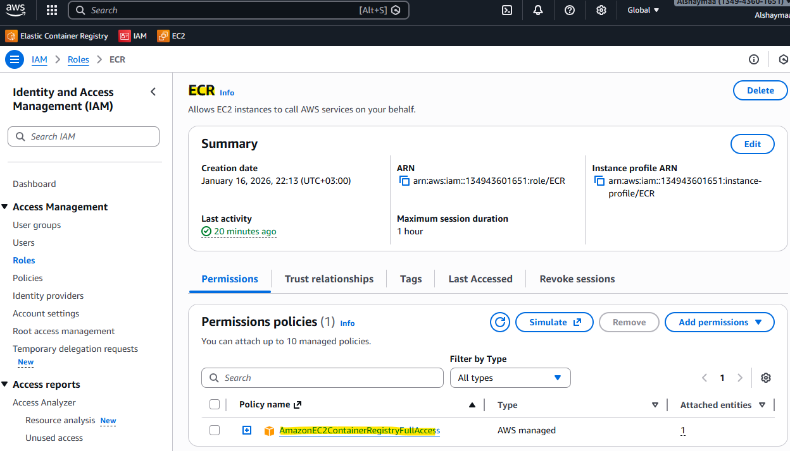
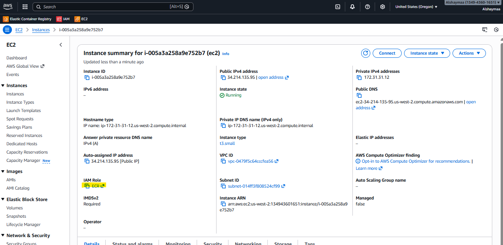
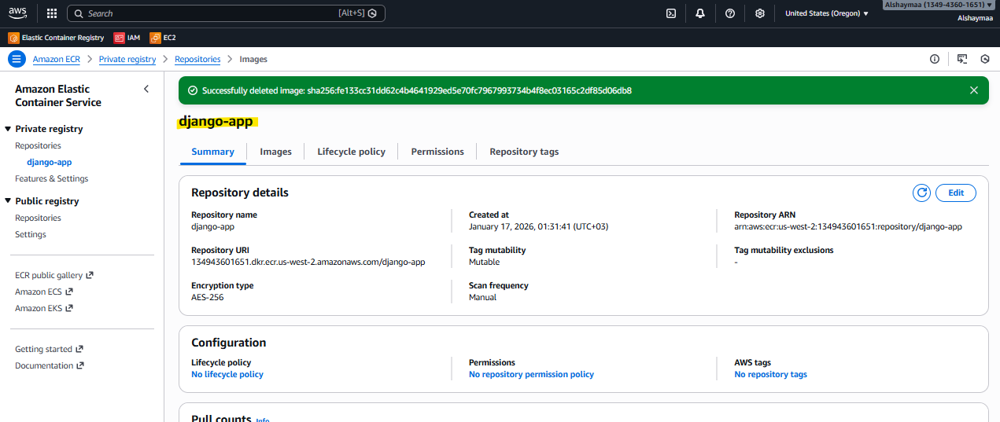
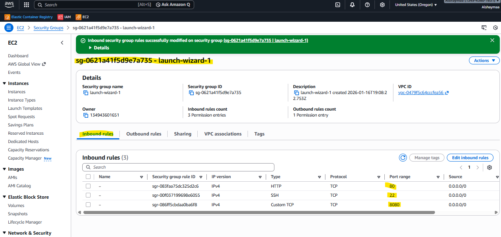
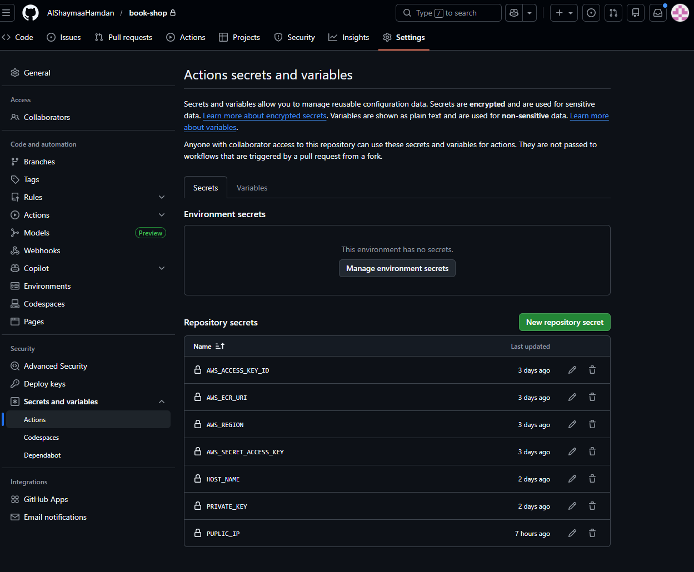
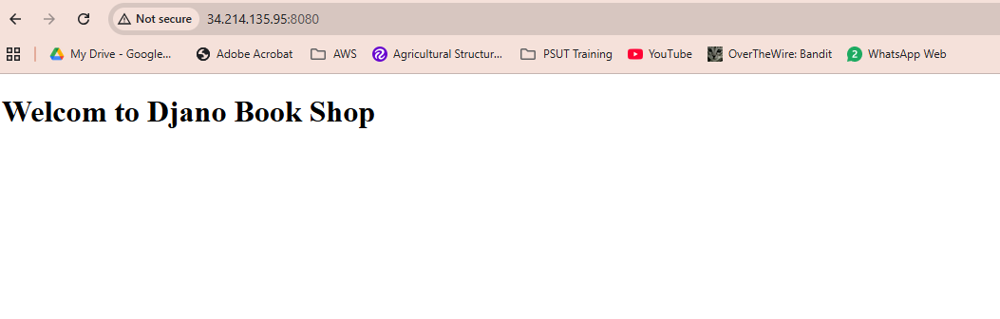
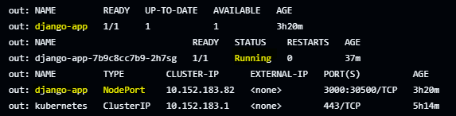
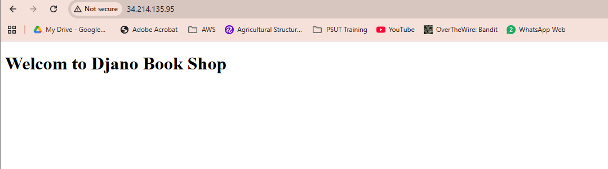

# Book Shop — CI/CD & DevOps Pipeline
______

This repository contains an automated CI/CD pipeline for building, testing, containerizing, promoting, and deploying the Book Shop Python application using:

GitHub Actions for automated workflows

Docker for containerization

AWS ECR (Elastic Container Registry) for storing images

Kubernetes / EC2 server for running the app

NGINX as a reverse proxy

## Pipeline Overview 
The workflow consists of 6 jobs, executed in this order:

**Pipeline Overview**

* Code Commit / Pull Request

Any changes pushed to main or prod branches trigger the GitHub Actions pipeline.

* Build & Test

The pipeline installs dependencies, runs tests, and lints the code.

* Docker Image Build

The application is packaged into a Docker container.

* Push to Container Registry

The Docker image is pushed to AWS ECR (or any configured container registry).

* Deploy to Server / Cluster

Kubernetes manifests (in k8s/) are applied, updating the deployment with the new image.

NGINX is configured to route traffic to the updated pods.

## AWS Configuration

1. Create Policy with permission "AmazonEC2ContainerRegistryPowerUser"  and attach it to the EC2.


2. Create Access Key and save the credentials.
3. Create ECR Repository (django-app)

4. Launch EC2 server and configure it. (you can use setup-server.sh to setup the server)
 EC2 Configuration:
  - install Docker on it.
  - Configure the EC2 SG: Inbound Rules (Ports 80, 8080, 22)
  
  - install NGINX, microk8s, AWS cli.

## GitHub Configuration:
  Add these secrets to GH Actions Secrets:
  - AWS_ACCESS_KEY_ID
  - AWS_SECRET_ACCESS_KEY
  - AWS_REGION
  - AWS_ECR_URI
  - PUPLIC_IP
  - HOST_NAME
  - PRIVATE_KEY



## Workflow Explanation

**Job**: prepare  
**Purpose**: Extract version information from pyproject.toml  
**Steps**:
Checkout the repository
Install tomlq to parse TOML files
Extract the version using tomlq and save it to:
- Environment variable VERSION
- version.yaml artifact for downstream jobs
Debug the extracted version
Upload version.yaml as an artifact

**Job**:  build  
**Purpose**: Build and package the Django application  
**Dependencies**: prepare  
**Steps**:  
Checkout code
Download version.yaml artifact
Load the version into environment variable VERSION
Setup Python environment (Python 3.12)
Install poetry for dependency management
Package the Django app using poetry build
- this wil create these 2 files: book_shop-0.1.0.dev1-py3-none-any.whl & book_shop-0.1.0.dev1.tar.gz
Upload the built artifacts from book-shop/dist/

**Job**: docker  
**Purpose**: Build Docker image and push to AWS ECR  
**Dependencies**: build  
**Steps**:  
Checkout code
Download version.yaml and load VERSION
Download built dist artifacts
Configure AWS credentials
Login to AWS ECR
Build Docker image using book-shop/Dockerfile
Tag image with $VERSION and push to AWS ECR

**Dockerfile Overview**

```bash
# Use the official Python runtime image
FROM python:3.15-rc-slim
 
# Set the working directory inside the container
WORKDIR /app
 
# Set environment variables 
# Prevents Python from writing pyc files to disk
ENV PYTHONDONTWRITEBYTECODE=1
#Prevents Python from buffering stdout and stderr
ENV PYTHONUNBUFFERED=1 

# Copy wheel and install it
COPY *.whl /app/

RUN pip install /app/*.whl
 
# Expose the Django port
EXPOSE 4000
EXPOSE 3000

# Run Django’s development server
ENTRYPOINT ["gunicorn"]
CMD ["book_shop.wsgi:application", "--bind", "0.0.0.0:4000"]

```
Uses an official lightweight Python image as the base.
Sets the working directory inside the container to /app.
Copies the built wheel file for the Django app into the container and installs it.
Exposes ports 4000 and 3000 for the application.
Uses gunicorn to serve the Django app on all network interfaces.

**Job**: promote  
**Purpose**: Promote the latest dev tag to a stable production tag  
**Dependencies**: docker  
**Runs only on**: prod branch  
**Steps**:  
Configure AWS credentials and login to ECR
Identify the latest dev image tag from ECR (ex. Latest_tag = 0.1.0.dev1 & BASE_TAG=0.1.0)
Derive the base tag for production
Output LATEST_TAG and BASE_TAG for downstream jobs

**Job**: push-promoted-image  
**Purpose**: Tag the promoted image and push to ECR  
**Dependencies**: promote  
**Runs only on**: prod branch  
**Steps**:  
Debug promote outputs (LATEST_TAG and BASE_TAG)
Configure AWS credentials and login to ECR
Pull the latest dev image (LATEST_TAG), tag it with the production tag (BASE_TAG), and push it to ECR Repo (django-app)

**Job**: deploy-dev  
**Purpose**: Deploy the app to the development environment  
**Dependencies**: docker  
**Runs only on**: main branch  
**Steps**:  
Checkout code and download version.yaml
Load VERSION into environment
SSH into server
- Login to ECR and pull Docker image
- Stop and remove existing container if it exists
- Run a new container on port 8080 (Website can be viewed using ec2-publicIP:8080)



**Job**: deploy  
**Purpose**: Deploy the app to production (EC2 + Kubernetes + NGINX)  
**Dependencies**: promote, push-promoted-image  
**Runs only on**: prod branch  
**Steps**:  
Checkout code and download version.yaml
Configure AWS credentials and login to ECR
Copy bookshop.conf (NGINX config) via SCP and link to sites-enabled
Reload NGINX
Copy Kubernetes manifests via SCP (deployment.yaml & service.yaml)
SSH to server and:
- Login to ECR (This enables pulling the promoted Docker image that was pushed during the build stage)
- Create Docker registry secret in microk8s (This ensures MicroK8s can securely authenticate and pull private images from AWS ECR)
- Apply Kubernetes deployment and service manifests (This creates or updates Kubernetes resources such as: Deployments & Services)
- Update deployment image with promoted tag (The deployment is patched with the new image tag promoted in the pipeline. This triggers a rolling update without downtime)
- Verify deployments, pods, and services (Website can be viewed using ec2-publicIP:80)



**NGINX Configuration** (bookshop.conf)
This NGINX server block listens on port 80 and acts as a reverse proxy for the Django application running on Kubernetes. When a request comes to the server, NGINX forwards it to http://localhost:30500/, which is the NodePort exposed by the Kubernetes Service.

```bash
server {
    listen 80;
    server_name localhost;

    location / {
        proxy_pass http://localhost:30500/;  # or your Python app IP:port
        proxy_set_header Host $host;
        proxy_set_header X-Real-IP $remote_addr;
        proxy_set_header X-Forwarded-For $proxy_add_x_forwarded_for;
    }
}
```

**Deployment** (deployment.yaml)

The Deployment creates and manages the django-app pod using the image from AWS ECR, pulled through the ecr-secret. It overrides the default command to run the Django app with Gunicorn on port 3000 and applies basic CPU and memory limits.

**NodePort** (service.yaml)
The Service exposes the app externally using NodePort 30500, mapping external traffic to the container’s port 3000 so the application can be accessed using the server’s public IP.

## Project Structure

```bash
.
├── .github/workflows/       # CI/CD pipeline workflows
│   └── pipeline.yml         # Automated build, test, deploy
├── k8s/                     # Kubernetes deployment manifests
│   ├── deployment.yaml
│   ├── service.yaml
├── Dockerfile               # Container image build instructions
├── setup-server.sh          # Server setup scripts (NGINX, Docker, microk8s, AWS CLI)
├── bookshop.conf            # NGINX configuration
└── README.md                # Project documentation

```

## How to Run the Pipeline

The CI/CD pipeline runs automatically whenever you push changes to the main or prod branches. No manual intervention is required.

To trigger it:

1. Push Code

Commit your changes and push them:
 
```bash
git add .
git commit -m "update"
git push origin main
```
Or push to **prod** if you want to **promote a new image**.

2. GitHub Actions Starts Automatically

When the push is detected:
prepare job extracts the version.
build job builds the wheel and pushes the Docker image to ECR.
deploy job SSHs into the EC2 server and updates Kubernetes + NGINX / deploy with docker.

3. Check Pipeline Status

Go to:
GitHub repo → Actions → Select workflow

You can view logs for each job and step.